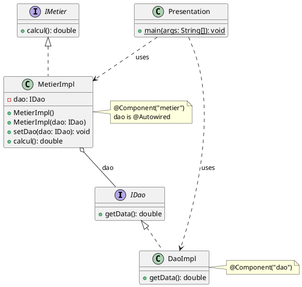

# Projet d'Injection des Dépendances

## Description du Projet
Ce projet démontre différentes méthodes d'injection de dépendances en Java, utilisant à la fois des approches natives et le framework Spring. Il illustre quatre méthodes différentes d'injection : statique, dynamique, XML Spring, et annotations Spring.

## Structure du Projet

### Architecture
```
src/main/java/com/mycompany/injection_de_dependence/
├── dao/
│   ├── IDao.java         # Interface DAO
│   └── DaoImpl.java      # Implémentation du DAO
├── metier/
│   ├── IMetier.java      # Interface métier
│   └── MetierImpl.java   # Implémentation métier
└── presentation/
    └── Presentation.java # Point d'entrée de l'application
```

## Diagramme de Classe


### Composants Principaux

1. **Couche DAO (Data Access Object)**
   - `IDao`: Interface définissant la méthode `getData()`
   - `DaoImpl`: Implémentation retournant une valeur fixe (15.0)

2. **Couche Métier**
   - `IMetier`: Interface définissant la méthode `calcul()`
   - `MetierImpl`: Implémentation effectuant un calcul basé sur la valeur du DAO

3. **Couche Présentation**
   - `Presentation`: Classe principale démontrant les différentes méthodes d'injection

## Méthodes d'Injection Implémentées

### 1. Injection Statique
- Instanciation directe des objets
- Couplage fort entre les composants
- Code :
```java
DaoImpl dao = new DaoImpl();
MetierImpl metier = new MetierImpl(dao);
```

### 2. Injection Dynamique
- Utilisation de la réflexion Java
- Configuration via fichier texte (config.txt)
- Chargement dynamique des classes
- Plus flexible, permet le changement des implémentations sans recompilation

### 3. Injection Spring XML
- Configuration via fichier XML (config.xml)
- Définition des beans et leurs dépendances en XML
- Utilisation de ClassPathXmlApplicationContext

### 4. Injection Spring Annotations
- Utilisation des annotations Spring (@Component, @Autowired)
- Configuration automatique via scan des composants
- Utilisation de AnnotationConfigApplicationContext

## Fichiers de Configuration

### config.txt (pour l'injection dynamique)
```
com.mycompany.injection_de_dependence.dao.DaoImpl
com.mycompany.injection_de_dependence.metier.MetierImpl
```

### config.xml (pour Spring XML)
```xml
<beans>
    <bean id="dao" class="com.mycompany.injection_de_dependence.dao.DaoImpl"/>
    <bean id="metier" class="com.mycompany.injection_de_dependence.metier.MetierImpl">
        <property name="dao" ref="dao"/>
    </bean>
</beans>
```

## Annotations Utilisées

- `@Component`: Marque les classes comme beans Spring
- `@Autowired`: Injection automatique des dépendances
- Les composants sont annotés avec des identifiants spécifiques (@Component("dao"), @Component("metier"))

## Résultats d'Exécution
Chaque méthode d'injection produit le même résultat (30.0), calculé comme suit :
1. DAO retourne 15.0
2. Métier multiplie cette valeur par 2
3. Résultat final = 30.0

## Avantages et Inconvénients

### Injection Statique
✅ Simple à comprendre
❌ Couplage fort
❌ Non flexible

### Injection Dynamique
✅ Flexible
✅ Configuration externe
❌ Plus complexe à mettre en œuvre
❌ Sensible aux erreurs de syntaxe

### Spring XML
✅ Configuration externe
✅ Flexible
❌ Verbeux
❌ Configuration XML lourde

### Spring Annotations
✅ Code plus propre
✅ Configuration minimale
✅ Auto-configuration
❌ Peut être moins explicite

## Conclusion
Ce projet démontre l'évolution des pratiques d'injection de dépendances, de l'approche statique basique aux solutions modernes basées sur Spring. Chaque méthode a ses cas d'usage appropriés, mais l'injection par annotations représente l'approche la plus moderne et maintenue.
